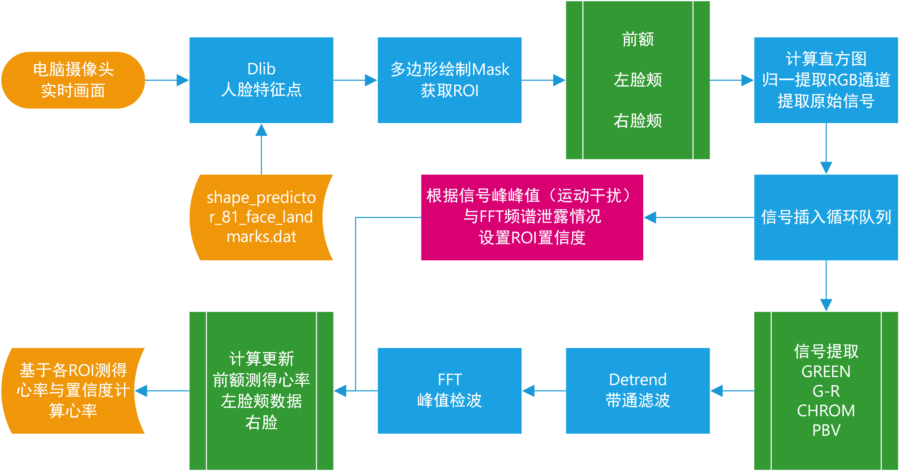

# 实时远程rPPG的应用

## 一、项目方案简介

心率是人体极其重要的生理指标，心率的准确测量对于疾病的诊断及治疗效果的评价具有重要作用。心率可以通过多种生物医学传感器加以测量，较为常规的是心电电极，亦可采用光电型脉搏波传感器等其它传感器。

本项目采用电脑摄像头采集面部数据以计算心率。

## 二、项目的原理与方法

**远程PPG（rPPG）算法：**

远程光电容积脉搏波 (rPPG) 通过使用多波长 RGB 相机检测人体皮肤表面脉冲引起的细微颜色变化，实现对人体心脏活动的非接触式监测 。

我们小组使用了两大类，共四种用于从视频ROI提取脉冲信号的rPPG 方法，其中包括：

1) Channel-Base：使用特定通道数据（GREEN[1]）或通道间的简单线性组合（G-R[2]）实现。 
1) Model-Based：CHROM[3]模型通过假设标准化的肤色对图像进行白平衡来线性组合色度信号。PBV[4]使用不同波长下血容量变化的特征来明确区分脉冲引起的颜色变化和 RGB 测量中的运动噪声

这些方法之间的本质区别在于将 RGB 信号组合成脉冲信号的方式。

**皮肤反射模型[5]：**

考虑一个光源照射一块含有脉动血液的人体皮肤组织和一个记录这幅图像的远程彩色相机。我们进一步假设光源具有恒定的光谱成分，但强度是变化的（在相机处观察到的强度取决于光源到皮肤组织和相机传感器的距离）。相机测量的皮肤有一种特定的颜色（相机测量的肤色是光源（例如强度和光谱）、固有肤色和相机颜色通道灵敏度的组合），这种颜色会随着时间的推移而变化，这是由于运动引起的强度/镜面反射的变化和脉冲引起的细微的颜色变化。这些时间变化与亮度强度水平成正比。

基于二色反射模型，记录的图像序列中每个皮肤像素的反射可以定义为 RGB 通道中的时变函数：
Ckt=It⋅(vs(t)+vd(t)+vn(t)

式中，Ck(t)表示第ｋ个皮肤像素在ｔ时刻的像素值；Ｉ(t) 表示光照强度， 它由光源本身亮度变化以及光源、 皮肤组织和相机之间的距离决定，它受到 Ｖs(t) 和Ｖd(t) 两种反射的调制， 其中，Ｖs(t) 表示镜面反射，代表由皮肤发出类似镜面的反射光；Ｖd(t) 表示漫反射，代表皮肤组织散射和吸收的光；而Ｖn(t)表示相机的量化噪声。

镜面反射Vs是来自皮肤表面的， 类似于镜面的光照反射， 由于大部分光线均被皮肤表面反射， 只有少部分光线进入皮肤组织内， 因此镜面反射是两种反射成分的主要部分， 且它不包含任何脉搏信息。但由于人体运动会导致光线、 皮肤表面和相机的角度和距离发生变化， 所以镜面反射也包含变化的成分，由此，镜面反射Vs可以定义为：
Vst=us⋅(s0+st)
`	`式中，us代表由相机捕捉的镜面反射光光谱的单位颜色向量，即红绿蓝三种颜色对镜面反射光强的贡献程度；s0和s(t)分别代表镜面反射的直流部分和交流部分的光强。

漫反射Vd与被皮肤组织吸收和反射的光线有关，是脉搏信号的主要成分。皮肤组织对光照反射的影响主要与皮肤表皮组织的色素沉着，如黑色素，胡萝卜素，以及血液中血红蛋白的浓度有关。其中，黑色素， 胡萝卜素等影响皮肤的固有反射， 随时间保持不变。而血红蛋白浓度随心脏活动而发生周期性变化，因此，经血红蛋白反射的光线强度也会产生周期性变化，从而反映脉搏信息。由此，漫反射Vdt可以定义为：

Vdt=ud⋅d0+up⋅p(t)

式中，ud表示皮肤表皮组织的单位颜色向量，其方向主要由色素沉着决定，和肤色的深浅有关；d0表示固有的漫反射的强度。由于血液对不同颜色光线的吸收程度不同，因此up代表脉搏信号中不同颜色通道的贡献程度，p(t)表示脉搏信号的强度。

可以看出，镜面反射Vs和漫反射Vd中都包含不随时间改变的静止部分和随时间改变的动态部分，将两种反射的静态部分组合起来，可表示为：

uc⋅c0=us⋅s0+ud⋅d0

式中，uc表示皮肤固有反射的单位颜色向量；c0表示固有反射的光照强度。

同样地，I(t)也可以分为固有光强I0以及随时间变化的光强i(t)，I0和i(t)具有相同的方向，可表示为:

It=I0⋅(1+i(t))

将上两式带入原模型， 得到皮肤反射模型如下:

Ck(t)=I0\*(1+i(t))\*(uc\*c0+us\*s(t)+p(t))+Vn(t)

现有的rPPG方法大多是通过对每一帧ROI区域中的像素点进行空间平均来构成时域信号， 而足够像素点的空间平均能有效降低相机的量化噪声(即可忽略Vn(t))。同时， 相比于相机捕捉的直流分量， 交流分量的强度很小， 因此， 交流分量的乘积项， 如ｉt⋅s(t)、ｉ(t)·p(t)等可以忽略不计。考虑以上两点， 并将式(6)展开， 可得到:

Ckt≈I0⋅uc⋅c0+I0⋅uc⋅c0⋅it+I0⋅uc⋅st+I0⋅up⋅p(t)

式中，I0⋅uc⋅c0代表信号的大而稳定的直流分量，其大小不随时间变化， 后三项为信号的交流分量。为了获取最终的脉搏信号p(t)， 需要除去照明光的直流分量I0⋅uc⋅c0以及两个交流分量： 光强变化信号 I0⋅uc⋅c0⋅i(t) 和镜面反射信号I0⋅uc⋅st的影响。

至此，观测值C(t)变成是三个源信号 i(t)，s(t)和p(t)的线性混合。这意味着通过使用线性投影，我们能够分离这些源信号。因此，从观察到的 RGB 信号中提取脉冲信号的任务可以转化为定义投影平面以分解C(t),最终得到含有脉搏信号p(t)。

## 三、项目的实施过程

（1）使用电脑摄像头采集画面。

（2）使用shape\_predictor\_81\_face\_landmarks[6]模型获得人脸的81特征点。

（3）连接特征点闭合成多边形，采集人脸左右侧脸颊和额头的mask，并腐蚀来保证采集到的mask不包含外界环境信息，获取ROI。

原本我们是只准备使用68点的人脸信息，但是在中期报告的课堂上，其他小组说使用81点的数据可以获取额头特征点，所以我们最后采用了81点的特征数据。

（4）计算各ROI的颜色直方图，提取RGB通道。

（5）将各ROI的RGB数据压入循环队列。

（6）根据QComboBox中所选择的信号提取手段，处理ROI的RGB队列并获取bvp信号。

（7）使用Obspy包[7]下到detrend工具滤除bvp信号的多项式趋势，后使用5阶Butterworth带通滤波器滤波。

（8）参考CHROM和POS方法，对滤波信号FFT后计算其频谱，随后峰值检波获取各ROI的瞬时心率。

（9）加权更新心率BPMn=α⋅BPMn-1+1-αBPMSig(n)，取α=0.95保证各ROI的心率结果不会跳变。

(10) 基于各ROI的原始bvp信号峰峰值与频谱泄露程度设置各ROI的BPM置信度，基于置信度加权求和计算最终心率结果

以上步骤为电脑端RPPG的主要计算流程，UI界面采用PyQT编写。实际情况由于数据处理计算量较大，单线程运行极易导致画面采集卡顿，因此采用多进程手段将以上步骤划分为多个线程，使用队列与共享内存实现线程见通信。

线程调度如下图所示：

界面效果如下图所示：

左上方下拉框中可选择我们所设计的四种信号提取方法：GREEN，G-R，CHROM和PBV。下方两按钮可控制画面中显示原始信号还是带通滤波后的信号。

右上方为采集的人脸图像画面，叠加了3个ROI对应的Mask。由于在测试阶段发现GREEN对于头动极为敏感，因此在图像中增加绿色椭圆与中心蓝标用于辅助头部稳定。

下方3\*3的波形图纵向分别代表信号、频谱与实时Mask的RGB直方图，横向分别代表三个ROI：前额、左脸颊与右脸颊的数据。

代码详见附录。

## 四、项目的结果分析

测试状态：静息态。由于运动后保持头部稳定难度较大，因此仅采取静息态用于测量。

测试环境：光照不稳定环境（灯光闪烁），光照稳定环境。

金标准：手环，心率测量app

测试结果：

1. GREEN：

ICC =		0.627971332047175

Kendall’s W =	0.5026809843658409

1. G-R：

ICC =		0.4230223303459752

Kendall’s W =	0.0809113394062735

` `

1. CHROM：

ICC =		0.8090896643704515

Kendall’s W =	0.6080194569339378

1. PBV：

ICC =		0.034908022328708495

Kendall’s W =	-0.02424286947827545

根据上述实验结果与一致性分析，我们基于ICC组内相关系数与Kendall W协调系数分析GREEN，G-R，CHROM和PBV四种rPPG信号提取手段所获取心率与金标准的一致性分析，可发现CHROM与GREEN方法提取的信号与金标准具有较高的一致性，G-R方法其次，PBV效果最差。而根据各方案的Bland-Altman图可看出，各方案的散点图都位于±1.96SD之间，说明各信号提取方案测量结果与金标准都具有一定的一致性。其中CHROM效果最佳，GREEN第二，G-R其次，PBV最次。

从模型原理分析，因为GREEN采集到的是原始信号，对于头动极为敏感，微小运动即可导致难以detrend的低频扰动。虽程序上我们设计了圆框辅助用户对准并保证头部稳定，但大部分运动情况下GREEN方案效果极不理想。以下分别为稳定与运动状态下提取信号的差异，可见区别极大。

G-R因为通道相减，滤除了部分共模干扰，抗头动干扰能力更强，但信号相较于GREEN更不明显，含有更多噪声毛刺，效果如下：

CHROM和PBV同为Model-based方案，此处PBV效果不理想的原因推断为其论文中所包含的预设条件：基于卤素灯和UI-2220SE-C相机的光学RGB滤光片，与此处我们的采集环境和光照环境并不吻合，而CHROM算法对于环境与镜头具有更高的鲁棒性，同时实验结果表明，PBV对于头动与GREEN方法一样敏感。然而两种方案所具有的相同点在于产生的信号不像GREEN和G-R一样具有肉眼可观测的心率特征，但在带通滤波后效果良好。以下分别为CHROM与PBV的信号波形：

## 五、参考文献

[1] Verkruysse, Wim, Lars O. Svaasand, and J. Stuart Nelson. "Remote plethysmographic imaging using ambient light." Optics express 16.26 (2008): 21434-21445.

[2] Lewandowska, Magdalena, et al. "Measuring pulse rate with a webcam—a non-contact method for evaluating cardiac activity." 2011 federated conference on computer science and information systems (FedCSIS). IEEE, 2011.

[3] De Haan, Gerard, and Vincent Jeanne. "Robust pulse rate from chrominance-based rPPG." IEEE Transactions on Biomedical Engineering 60.10 (2013): 2878-2886.

[4] De Haan, Gerard, and Arno Van Leest. "Improved motion robustness of remote-PPG by using the blood volume pulse signature." Physiological measurement 35.9 (2014): 1913.

[5] Wang, Wenjin, et al. "Algorithmic principles of remote PPG." IEEE Transactions on Biomedical Engineering 64.7 (2016): 1479-1491.

[6] King, Davis E. "Dlib-ml: A machine learning toolkit." The Journal of Machine Learning Research 10 (2009): 1755-1758.

[7] Beyreuther, Moritz, et al. "ObsPy: A Python toolbox for seismology." Seismological Research Letters 81.3 (2010): 530-533.
